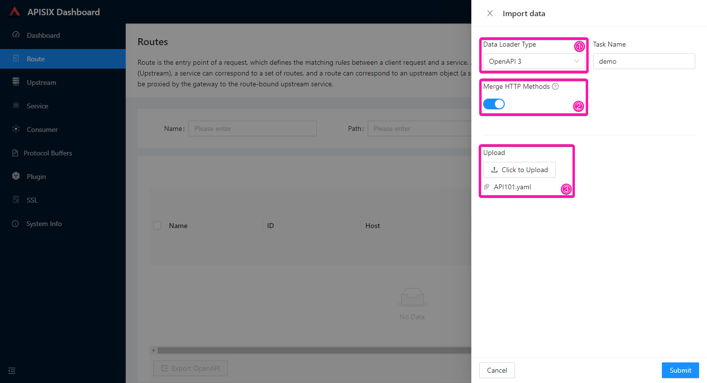
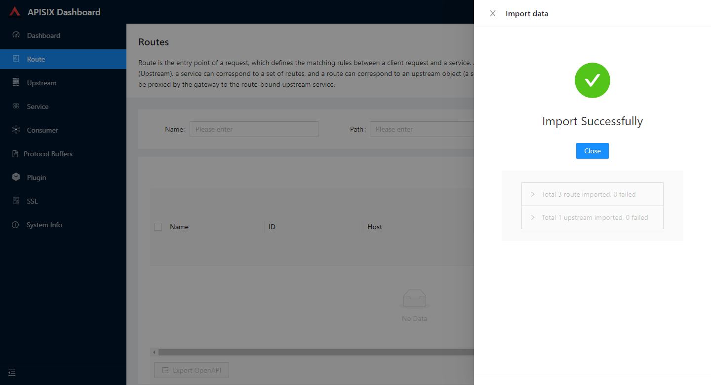
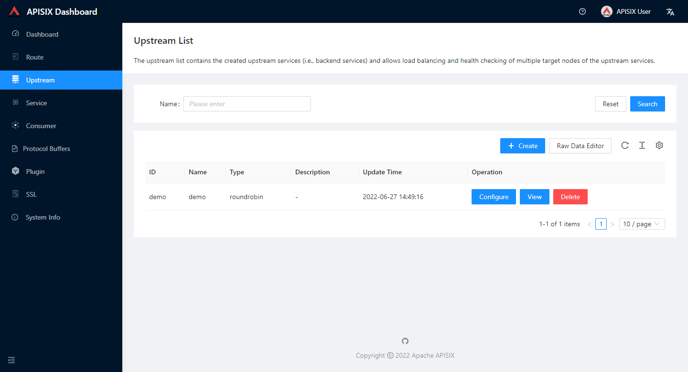
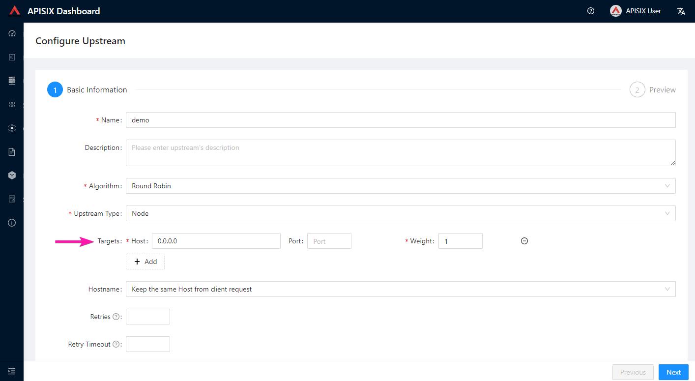

<!--
#
# Licensed to the Apache Software Foundation (ASF) under one or more
# contributor license agreements.  See the NOTICE file distributed with
# this work for additional information regarding copyright ownership.
# The ASF licenses this file to You under the Apache License, Version 2.0
# (the "License"); you may not use this file except in compliance with
# the License.  You may obtain a copy of the License at
#
#     http://www.apache.org/licenses/LICENSE-2.0
#
# Unless required by applicable law or agreed to in writing, software
# distributed under the License is distributed on an "AS IS" BASIS,
# WITHOUT WARRANTIES OR CONDITIONS OF ANY KIND, either express or implied.
# See the License for the specific language governing permissions and
# limitations under the License.
#
-->

## Overview

OpenAPI 3 data loader currently supports importing standard OpenAPI 3 documentation to generate individual paths as routes and upstreams in Apache APISIX.

## Configuration

| Name         | Type    | Default | Description                                                                                                                                                                                                                                                                                                                                                                                                            |
|--------------|---------|---------|------------------------------------------------------------------------------------------------------------------------------------------------------------------------------------------------------------------------------------------------------------------------------------------------------------------------------------------------------------------------------------------------------------------------|
| merge_method | boolean | true    | HTTP method merge. When an OpenAPI 3 Path has multiple HTTP methods, this parameter controls whether they are merged or not. When multiple HTTP methods have different detailed configurations, such as `securitySchema` etc., this parameter can be turned off to prevent the APISIX Dashboard importer from merging them into a single APISIX route, which will generate a route for each HTTP method for each Path. |

## Usage

### Import

1. Open the import drawer menu

2. Configure import parameters

Select `OpenAPI 3` in the data loader type and set a task name for this import, which will determine the name of the route and upstream generated by this import.

:::note

The current `OpenAPI 3` generates routes and upstream names according to this rule.

- When the task name is `demo` and the HTTP method merge is enabled.

| OpenAPI 3 Path & Method | APISIX route name  | APISIX route uri | APISIX route methods |
|-------------------------|--------------------|------------------|----------------------|
| GET /hello1             | demo_hello1        | /hello1          | GET                  |
| GET & POST /hello2      | demo_hello2        | /hello2          | GET, POST            |
| PUT /hello3/{name}      | demo_hello3/{name} | /hello3          | PUT                  |

- When the task name is `demo` and HTTP method merging is disabled.

| OpenAPI 3 Path & Method | APISIX route name        | APISIX route uri | APISIX route methods |
|-------------------------|--------------------------|------------------|----------------------|
| GET /hello1             | demo_hello1_GET          | /hello1          | GET                  |
| PUT & DELETE /hello2    | demo_hello2_PUT          | /hello2          | PUT                  |
|                         | demo_hello2_DELETE       | /hello2          | DELETE               |
| PATCH /hello3/{name}    | demo_hello3/{name}_PATCH | /hello3          | PATCH                |

Generate an empty upstream named `demo`, which has no node data configured for fields such as `nodes`, so users can modify it manually to meet their needs.

:::

The following shows the parameters for the `OpenAPI 3` data loader, which currently has the Merge HTTP Methods configuration.

Finally, select an OpenAPI 3 documentation file in Upload section and submit the form.

:::note
Only one OpenAPI 3 documentation file can be selected at this time.
:::

3. After submitting and viewing the import results

When the import successful, the generated routes and the number of upstreams will be displayed.

When the import fails, the number of errors and the reason for the error are displayed.

4. View the generated routes

5. Modify upstream configuration

The import process generates an upstream named `demo` with the same name as the import task.

It does not have an upstream node configured and cannot be requested properly yet, so you need to modify its node or service discovery configuration. Remove this default node and add node information according to your own service.

Save the upstream configuration.

6. Test API

Use the test tool to call the API to determine if it is configured correctly.

### Export

Not supported yet.
